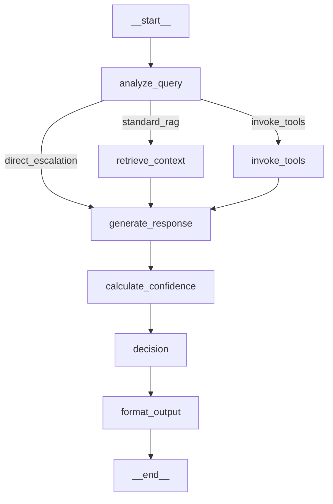

# Agent Graph Visualization

**Dynamic LangGraph visualization API** for admin dashboard integration.

## Overview

The agent uses **LangGraph** for workflow orchestration. These endpoints provide real-time visualization of the agent's state machine, automatically reflecting any changes to the graph structure.

## API Endpoints

All endpoints are under `/api/v1/admin/agent/graph/`

### 1. GET `/api/v1/admin/agent/graph/mermaid`

Get the agent graph as a **Mermaid diagram**.

**Query Parameters**:
- `format`: `"text"` (default) or `"json"`

**Response (format=text)**:
```
Content-Type: text/plain

graph TD
    __start__ --> analyze_query
    analyze_query --> retrieve_context
    retrieve_context --> generate_response
    ...
```

**Response (format=json)**:
```json
{
  "success": true,
  "mermaid": "graph TD\n    __start__ --> analyze_query\n...",
  "nodes": [
    {
      "id": "analyze_query",
      "name": "analyze_query",
      "type": "analysis"
    },
    ...
  ]
}
```

**Frontend Integration**:
```typescript
// Render using Mermaid.js
import mermaid from 'mermaid';

const response = await fetch('/api/v1/admin/agent/graph/mermaid?format=text');
const mermaidCode = await response.text();

// Render in your component
mermaid.render('graph-container', mermaidCode);
```

---

### 2. GET `/api/v1/admin/agent/graph/png`

Get the agent graph as a **PNG image**.

**Response**:
```
Content-Type: image/png
Content-Disposition: inline; filename=agent-graph.png

[PNG binary data]
```

**Frontend Integration**:
```typescript
// Display as image

```

**Note**: Uses Mermaid.ink API for rendering, requires internet connection.

---

### 3. GET `/api/v1/admin/agent/graph/info`

Get **metadata** about the graph structure.

**Response**:
```json
{
  "success": true,
  "nodes": [
    {
      "id": "analyze_query",
      "name": "analyze_query",
      "type": "analysis"
    },
    {
      "id": "retrieve_context",
      "name": "retrieve_context",
      "type": "retrieval"
    },
    ...
  ],
  "edges": [
    {
      "source": "__start__",
      "target": "analyze_query",
      "conditional": false
    },
    {
      "source": "analyze_query",
      "target": "retrieve_context",
      "conditional": true
    },
    ...
  ],
  "entry_point": "analyze_query",
  "total_nodes": 7,
  "total_edges": 8
}
```

**Use Case**: Build custom graph visualizations or show graph statistics in dashboard.

---

## Current Agent Graph Structure



### Node Types

| Node | Type | Description |
|------|------|-------------|
| `analyze_query` | analysis | Classify intent, determine routing |
| `invoke_tools` | tool | Execute tools (calculator, MCP, web search) |
| `retrieve_context` | retrieval | RAG - Get documents from vector store |
| `generate_response` | generation | LLM generates response with context/tools |
| `calculate_confidence` | scoring | Calculate confidence score (retrieval-quality model) |
| `decision` | decision | Threshold check - respond or escalate |
| `format_output` | formatting | Prepare final response structure |

### Conditional Routing

**From `analyze_query`**:
- → `invoke_tools`: Query needs tool execution
- → `retrieve_context`: Standard RAG path
- → `generate_response`: Direct escalation (no context needed)

---

## Dynamic Updates

**The graph is generated dynamically** from the actual LangGraph code, so:

✅ **Changes are automatically reflected** - No manual updates needed
✅ **Always in sync** - Graph matches actual agent behavior
✅ **Version-safe** - Works across agent configuration changes

### Example: Adding a New Node

**1. Update `app/agents/graph.py`**:
```python
def create_agent_graph():
    workflow = StateGraph(AgentState)

    # Add new node
    workflow.add_node("validate_input", validate_input_node)

    # Update routing
    workflow.add_edge("analyze_query", "validate_input")
    workflow.add_edge("validate_input", "retrieve_context")

    return workflow.compile()
```

**2. Graph API automatically reflects changes**:
- `/graph/mermaid` shows new `validate_input` node
- `/graph/png` renders updated graph
- `/graph/info` includes new node in metadata

**No code changes needed in the API!** 🎯

---

## Frontend Implementation Examples

### React with Mermaid.js

```typescript
import React, { useEffect, useRef } from 'react';
import mermaid from 'mermaid';

export function AgentGraphVisualization() {
  const containerRef = useRef<HTMLDivElement>(null);

  useEffect(() => {
    const fetchAndRenderGraph = async () => {
      // Fetch Mermaid diagram
      const response = await fetch('/api/v1/admin/agent/graph/mermaid?format=text');
      const mermaidCode = await response.text();

      // Initialize Mermaid
      mermaid.initialize({
        startOnLoad: false,
        theme: 'default',
        flowchart: {
          curve: 'basis',
          padding: 20
        }
      });

      // Render in container
      if (containerRef.current) {
        const { svg } = await mermaid.render('agent-graph', mermaidCode);
        containerRef.current.innerHTML = svg;
      }
    };

    fetchAndRenderGraph();
  }, []);

  return (
    <div className="agent-graph-container">
      <h2>Agent Workflow Graph</h2>
      <div ref={containerRef} />
    </div>
  );
}
```

### Simple Image Display

```typescript
export function AgentGraphImage() {
  return (
    <div className="graph-image-container">
      <h2>Agent Workflow</h2>
      
      <p className="text-muted">
        This graph is generated in real-time from the active agent configuration.
      </p>
    </div>
  );
}
```

### Custom Visualization with Graph Metadata

```typescript
import { useEffect, useState } from 'react';

interface GraphMetadata {
  nodes: Array<{ id: string; name: string; type: string }>;
  edges: Array<{ source: string; target: string; conditional: boolean }>;
  total_nodes: number;
  total_edges: number;
}

export function AgentGraphStats() {
  const [metadata, setMetadata] = useState<GraphMetadata | null>(null);

  useEffect(() => {
    fetch('/api/v1/admin/agent/graph/info')
      .then(res => res.json())
      .then(data => setMetadata(data));
  }, []);

  if (!metadata) return <div>Loading...</div>;

  return (
    <div className="graph-stats">
      <h3>Agent Graph Statistics</h3>
      <div className="stats-grid">
        <div className="stat-card">
          <span className="stat-value">{metadata.total_nodes}</span>
          <span className="stat-label">Total Nodes</span>
        </div>
        <div className="stat-card">
          <span className="stat-value">{metadata.total_edges}</span>
          <span className="stat-label">Connections</span>
        </div>
      </div>

      <h4>Node Breakdown</h4>
      <ul>
        {metadata.nodes.map(node => (
          <li key={node.id}>
            <strong>{node.name}</strong>
            <span className="badge">{node.type}</span>
          </li>
        ))}
      </ul>
    </div>
  );
}
```

---

## Caching Considerations

**The graph structure changes when**:
- Agent workflow is modified in `app/agents/graph.py`
- New nodes or edges are added/removed
- Routing logic is updated

**Recommendation**:
- Use `Cache-Control: no-cache` for PNG endpoint (already set)
- Refresh graph visualization when agent config is updated
- Consider showing "Last updated" timestamp in UI

---

## Error Handling

All endpoints return proper HTTP error codes:

**500 Internal Server Error**:
```json
{
  "detail": "Failed to generate graph visualization: [error message]"
}
```

**Common Issues**:
1. **Network Error (PNG)**: Mermaid.ink API unavailable
   - Solution: Fallback to `/graph/mermaid` with client-side rendering
2. **Import Error**: Agent graph compilation fails
   - Solution: Check `app/agents/graph.py` for syntax errors

---

## Testing

```bash
# Get Mermaid diagram (text)
curl http://localhost:8000/api/v1/admin/agent/graph/mermaid

# Get Mermaid diagram (JSON)
curl http://localhost:8000/api/v1/admin/agent/graph/mermaid?format=json

# Get PNG image
curl http://localhost:8000/api/v1/admin/agent/graph/png -o agent-graph.png

# Get graph metadata
curl http://localhost:8000/api/v1/admin/agent/graph/info
```

---

## OpenAPI Documentation

Available at: `http://localhost:8000/docs#/Agent%20Graph`

All endpoints are documented in the interactive Swagger UI with:
- Request/response examples
- Parameter descriptions
- Try-it-out functionality

---

## Related Files

- **API Implementation**: `app/api/v1/agent_graph.py`
- **Graph Definition**: `app/agents/graph.py`
- **Node Implementations**: `app/agents/nodes.py`
- **State Definition**: `app/agents/state.py`

---

## Summary

✅ **Three endpoints**: Mermaid text/JSON, PNG image, metadata
✅ **Auto-updating**: Always reflects current agent structure
✅ **Easy integration**: Simple fetch + render
✅ **Production-ready**: Error handling, caching headers
✅ **Documented**: Full OpenAPI/Swagger docs

Perfect for admin dashboard showing **real-time agent workflow visualization**! 🎯
